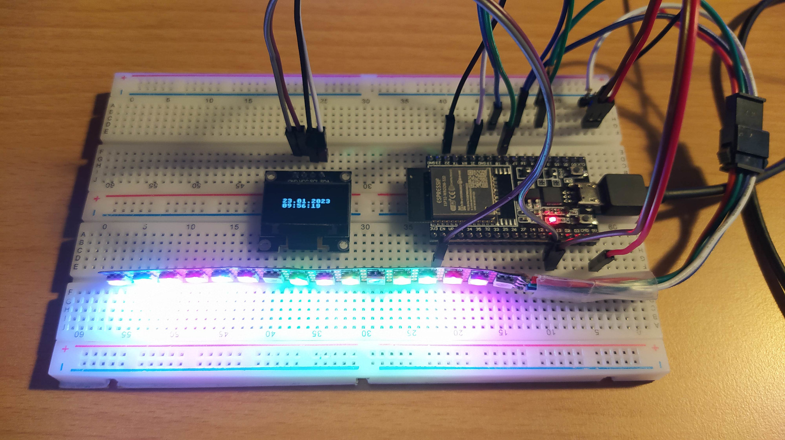

# ESP32 projects

## Used components:

1. HW components
   - ESP32-WROOM-32D target board
   - SSD1306 monochrome display
   - WS2813 RGB LED strip (16 LEDs)

2. SW components
   - Linux Mint 20.3 (kernel 5.4) development host
   - standard ESP-IDF Eclipse plug-in, [link](https://github.com/espressif/esp-idf.git)
   - external ESP-IDF-LIB library, [link](https://github.com/UncleRus/esp-idf-lib.git)

## Setup

1. Connection layout

ESP32-WROOM-32D | SSD1306 | WS2813 |
--- | --- | ---
3V3 | VCC | n/c
GND | GND | GND
21 | SDA | n/c
22 | SCL | n/c
5V | n/c | 5V
5 | n/c | DI

note: n/c - not connected

## Applications

1. Effects with the RGB LED strip (_**'led_effects'**_ example from an external ESP-IDF-LIB library: [link](https://github.com/UncleRus/esp-idf-lib.git))

1.1. Project development in Eclipse
  - Assume the locations of the external ESP-IDF-LIB library and its example application are in:
  ```
  $HOME/esp/esp-idf-lib  # library
  $HOME/esp/esp-idf-lib/examples/led_effects # example
  ```
  - If the example project should be imported into the default Eclipse workspace, then use Eclipse menu commands:
    - _'File'_ -> _'Import...'_ -> _'Espressif'_ -> _'Existing IDF Project'_: click on _'Next'_
      - On _'Import Existing Project'_ click on _'Browse...'_ to locate the existing project and click on _'Open'_
      - Re-name the project in _'Project Name'_ and enable the _'Copy project into workspace'_ checkbox
    - Alternately, if the example project should be imported into other location (ie., _'eclipse-workspace/esp32'_), use manual copy and then import it
      - Copy the example directory into your desired location (and re-name the directory)
      - Import it in Eclipse: nor copying in the workspace neigther re-naming of project is necessary
  - Edit _'CMakeLists.txt'_ to specify the external ESP-IDF-LIB library, otherwise compilation will fail (cannot find the included header files)
  ```
  set(EXTRA_COMPONENT_DIRS ${CMAKE_CURRENT_SOURCE_DIR}/../../../esp/esp-idf-lib/components)
  ```
  - Now the project can be built properly with the external library

1.2. Run the application on the Wokwi online [simulator]((https://wokwi.com))

  - Start the simulator on your web browser
  - Start with the new project with the _'ESP32'_ board
  - Load _'NeoPixel Ring'_ for WS2812 (yes, WS2812 and WS2813 are compatible)
  - Make 2 connections:
  ```
  ring1:GND - esp:GND.2
  ring1:DIN - esp:D5
  ```
  - On _'sketch.ino'_ tab press _'F1'_ button (or right click) to load the command palette
  - Select _'Load HEX and start simulation'_ command
  - Load your *.bin file:
  ```
  led_effects/build/example-led_effects.bin # from the local project directory
  ```
  - The simulation will run, 
    - debug output will be seen on the simulator serial monitor window
    - LED ring will play the programmed effects

1.3. Run the app on the target board, 

  - idle current is **10,15 mA**
  - max current usage is **37,92 mA** (default **brightness=20**)
  - adjust the brightness in the SDK configuration:
    - _'Example configuration'_ -> _'brightness of LEDs'_
    - with **brightness=10**, max current usage changes to **18,36 mA**
